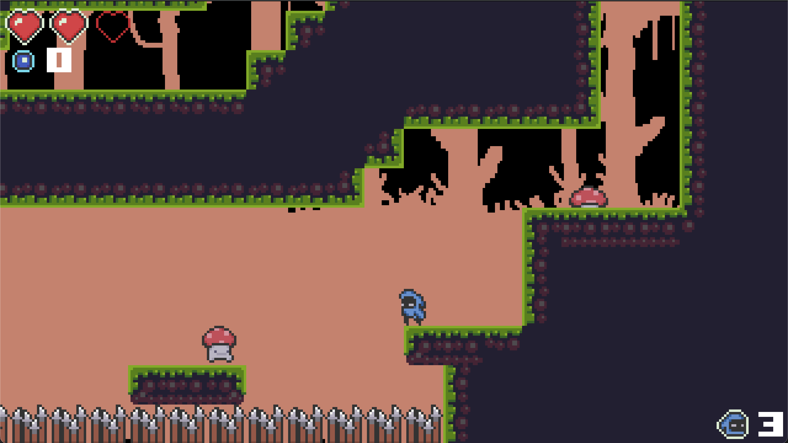
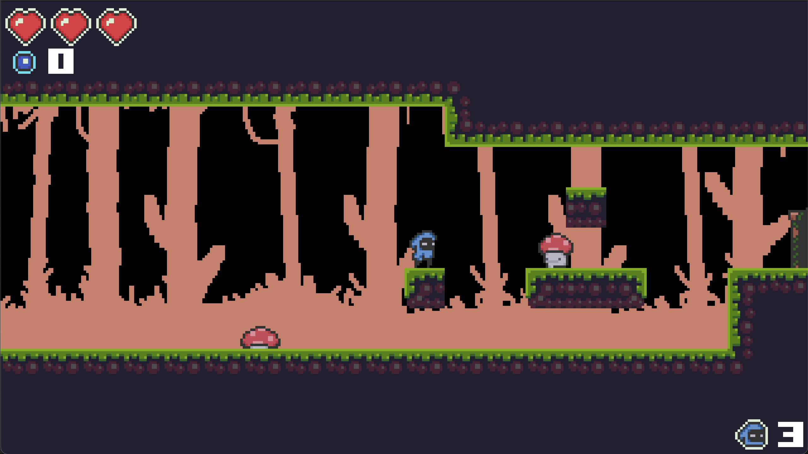

# Blue Hood

A pixel-art action-adventure game built with LÖVE2D. Currently in development.

## ⭐ Features

- 🎮 Smooth player movement
- ⚔️ Melee combat
- 👾 Enemy
- 💾 Save & Load
- 🗺️ Multiple maps
- 🎵 Dynamic soundtrack

## 🛠️ Built With

- Lua
- LÖVE2D
- Tiled
- Aseprite

## 📷 Screenshots





## 🚀 Getting Started

### Requirements

Before running the project, make sure you have:

- LÖVE 11.4 or newer installed
- Git (optional, for cloning the repository)

### Installation

Clone the repository:

```bash
git clone https://github.com/Przemekkkth/blue-hood
cd blue-hood
```

### Running the project

Run the game using LÖVE:

```bash
love .
```

Or drag the project folder onto the LÖVE executable.

## 🎨 Assets

- The lovely [art](https://o-lobster.itch.io/platformmetroidvania-pixel-art-asset-pack) and [music](https://o-lobster.itch.io/music-pack-all-is-a-loop) is by o-lobster on itch.io.
- SFX :[[1]](https://ci.itch.io/400-sounds-pack), [[2]](https://leohpaz.itch.io/minifantasy-dungeon-sfx-pack) 

## 🧩 Libraries
- [concord](https://github.com/Keyslam-Group/Concord): a feature-complete ECS library
- [boipushy](https://github.com/a327ex/boipushy): input module for LÖVE
- [classic](https://github.com/rxi/classic): tiny class module for Lua
- [lume](https://github.com/rxi/lume): Lua functions geared towards gamedev
- [sti](https://github.com/karai17/Simple-Tiled-Implementation): tiled library for LÖVE
- [windfield](https://github.com/a327ex/windfield): physics module for LÖVE

## 📜 License

MIT

## Addons
- [LÖVE](https://love2d.org) is an *awesome* framework you can use to make 2D games in Lua
- [marclurr's love2d-platformer](https://github.com/marclurr/love2d-platformer) - inspiration